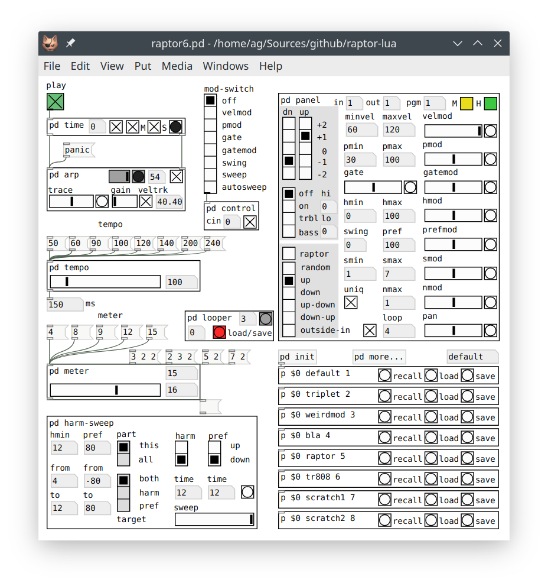

# Raptor: The Random Arpeggiator

March 2021  
Albert Gräf <aggraef@gmail.com>  
Dept. of Music-Informatics  
Johannes Gutenberg University (JGU) Mainz, Germany

The raptor6.pd patch implements an experimental arpeggiator program based on the mathematical music theories of the contemporary composer and computer music pioneer Clarence Barlow. This is already the 6th iteration of this program, now ported to Lua so that it can be run easily with any Pd version. Compared to earlier versions, it also features a much cleaner source code and many noticeable improvements, including more robust timing, proper MIDI clock sync, and a built-in looper. We recommend running this patch with [Purr Data][], Jonathan Wilkes' modern Pd flavor, as it has all the required externals including Pd-Lua on board, and the layout of the GUI has been optimized for that version. But the patch should also work fine in "vanilla" [Pd][] if you have [Pd-Lua][] and [Zexy][] installed. **NB:** When using vanilla Pd, a version of Pd-Lua for Lua 5.3 or later is required, you can find this [here](https://agraef.github.io/pd-lua/); Zexy can be installed from [Deken][]. The screenshot below shows the patch running in Purr Data.

Raptor is quite advanced as arpeggiators go, it's really a full-blown algorithmic composition tool, although it offers the usual run-of-the-mill deterministic and random arpeggios as well. But the real magic starts when you turn on `raptor` mode and start playing around with the parameters in the panel. The algorithm behind Raptor is briefly sketched out in my [ICMC 2006 paper][] (cf. Section 8), and you'll find some practical information to get you started below. But if you'd like to get a deeper understanding of how the algorithm actually works, you'll have to dive into the source code and read Barlow's article in the [Ratio book][].

Using the patch is easy enough, however. Hook up your MIDI keyboard and synthesizer to Pd's MIDI input and output, respectively, press the green `play` button and just play some chords. I'm mostly driving Raptor with a MIDI guitar and a [Nektar PACER][] foot pedal these days, so the patch is somewhat tailored to that use case, but it also works fine with just a MIDI keyboard and a free software synth such as [Qsynth][].

This project is still work in progress. In particular, the included presets need some work, but hey, you get them for free, so feel free to modify and use them for whatever purpose! ;-) Bug reports and other contributions are welcome. Also, I'm curious about uses of my programs, so please do send me links to music produced with Raptor!

## Getting Started

When Raptor launches, all parameters are set to factory defaults, which can be found in the `init` subpatch. A few sample presets are included in the presets folder, use the `p` abstractions in the lower right corner of the main patch to switch between these, or create your own. As shipped, the first preset labeled `default` is identical to the factory defaults, so that you can quickly restore some sane defaults if needed. More presets can be found in the `more...` subpatch.

Presets are stored on disk as editable text files in Pd's qlist format (which basically just lists parameter names and their corresponding values). The file name is specified using the second argument of the `p` abstraction, and the third argument indicates the PC (program change) number which can be used to select the preset using MIDI control. The latter is optional, but the first argument of the `p` abstraction is mandatory and *must* be `$0`, which tells the abstraction which Raptor instance to operate on.

The main patch has quite a few controls to change meter, tempo, and the other parameters of the algorithm, as well as a few MIDI-related settings (input and output channel, program number) in the `panel` and `harm-sweep` subpatches. The current state of all these parameters is stored in a preset on disk if you hit the `save` button, so that you can recall it later with the `recall` button. The `load` button lets you reload a preset from disk and immediately recall it, which is useful if you edited the preset outside of Raptor in a text editor. And of course all presets are reloaded automatically when you launch Raptor.

For live performance, the patch contains a control subpatch for the PACER, and I've also included my modified PACER setup in case you want to use it, please check the pacer subdirectory in the distribution and the included [description](pacer/PACER.md) for details. But all the various switches and parameters are also accessible through the GUI or the MIDI bindings listed below.

## The GUI

Before we go into Raptor's MIDI controls, let's have a quick look at some important GUI (graphical user interface) controls in the Raptor patch that you should know about. As indicated below, some of these are saved in the patch itself, so you can just save the patch to change their defaults.

First, in the main patch there's the `mod-switch` control (saved in the patch) which assigns some PACER controls to various different parameters for hands-free operation. Most related controls can be found in the `panel` subpatch; the most prominent of these are the yellow mute toggle (labeled `M`) which mutes the arpeggiator (stops all note output), and the green hold toggle (labeled `H`) which holds all note input in memory, so that the arpeggiator keeps playing the same pattern while this toggle is engaged. These are mostly intended for live control and automation, so they both have MIDI bindings (CC64 and CC67). Of course, you can also operate them in the GUI, but their state is neither saved in the patch nor in presets.

The `mod-switch` control goes into the `control` subpatch which contains the interface to the PACER and some other basic MIDI control functions. This subpatch also has a numbox (labeled `cin`) and a toggle (both saved in the patch) which allow you to set Raptor's control input channel, and to enable control input separately for each Raptor instance. By default, the MIDI channel is set to 0 (omni) and control input is enabled. The control input toggle is mostly for interactive usage, if you need to restrict control input to individual instances in a multi-Raptor setup. The MIDI channel can be set (and saved) to accommodate your studio or stage setup. E.g., it often makes sense to have all your control inputs, such as the PACER, a fader box, or MIDI automation from your DAW, go into a separate Pd input port, so that normal MIDI input from other devices doesn't accidentally interfere with Raptor's MIDI control. Pd has a set of 16 MIDI channels for each MIDI input, so you can set the control input channel, e.g., to 17 in order to receive control data on channel 1 of the second MIDI input.

Next, in the `time` subpatch there are the time master and MIDI clock sync toggles (labeled `M` and `S`, respectively, both saved in the patch), which will be discussed in the section on tempo and time below. There's another (unlabeled) start/stop toggle (not saved) which enables you to start and stop the sequence manually, and a pulse button to trigger individual pulses in a step-wise fashion, which can be useful for debugging purposes. The pulse button also goes red to indicate MIDI clock sync, in which case you better not mess with it to keep Raptor in sync with the time source. Also, the little "anacrusis" numbox on the left will set the pulse offset from the beginning of a bar (counting from zero) when playback starts. This is filled in automatically if your DAW sends song position pointer (SPP) messages, but you can also set it manually (whether using MIDI clock sync or not) if you need to start playback on an upbeat.

Last but not least, there's the `arp` subpatch containing the guts of the arpeggiator itself. You can send a `panic` message to the arpeggiator to kill hanging notes, and switch the metronome tick on and off with the toggle control in the upper-right corner (saved in the patch). The gray slider displays the pulse strengths, and the gray beat indicator next to it briefly flashes at the beginning of each bar (it also goes red if you stop the sequence, until the arpeggiator finishes playing the current bar). We mention in passing that the metronome "tick" does a lot more than just clicks, instead it generates notes of varying velocities for a GM drumset on channel 10; the note number can be set with the little numbox, saved in the patch.

In the second row you find some options affecting note input and output. The `trace` control (saved in the patch) changes the amount of time that incoming note-offs are delayed. This produces a kind of "legato" effect, making notes stick around a little longer while you're changing chords. The slider goes from 0 to 600 ms and should be adjusted to your playing style; zero means off, and the default is 300 ms. The `gain` control ties in with the *velocity tracker*, a function which calculates a kind of envelope from the velocities of the notes that you play and adjusts the velocities of output notes generated by the arpeggiator accordingly, so that they follow your performance. Normally, this value actually controls the mix between preset velocity values (`minvel`, `maxvel`) and the calculated envelope, and ranges from 0 (all envelope) to 127 (all preset). However, during loop playback it becomes a real gain control which changes the output velocities by -3 to +3 dB (half to double velocity). The `gain` control is bound to the MIDI volume controller (CC7) and also stored in presets. Both `trace` and `gain` also have buttons to quickly reset them to their default center values. The `transp` control (which also has a MIDI binding and is stored in presets) lets you transpose the note output by a given number of semitones.

Finally, hidden away at the bottom of the `arp` subpatch you'll find two additional toggles, `bend` and `touch` (both saved in the patch), which determine whether to pass through pitch bend and aftertouch (a.k.a. channel pressure) messages from MIDI input to output. As shipped, pass-through is enabled for pitch bend and disabled for aftertouch, but you can change this to whatever you like if you open that subpatch.

## Control

Most of Raptor's parameters have MIDI bindings, so they can be automatized, e.g., in a DAW:

| Control    | Range     | Meaning                                                      |
| ---------- | --------- | ------------------------------------------------------------ |
| PC         | 0..127    | selects preset 1-128                                         |
| CC1        | 0..127    | harmonicity sweep (also bound to CC11 in the PACER configuration) |
| CC7        | 0..127    | velocity tracker level (0 = tracker, 127 = preset) and loop gain (-3..+3 dB) |
| CC8        | 0..127    | pan (0 = hard left, 127 = hard right, 64 = center)           |
| CC13       | 0..3      | pitch tracker mode (controls voicing, 0 = off, 1 = on, 2 = treble, 3 = bass) |
| CC14, CC15 | -64..63   | pitch lo and hi (low and high offsets for the pitch tracker in semitones) |
| CC16, CC17 | -64..63   | octave range (number of octaves down, up, meaningful range is -2..2) |
| CC18       | -64..63   | transpose (transposes output by the given number of semitones) |
| CC19       | 0..5      | arp mode (0: random, 1: up, 2: down, 3: up-down, 4: down-up, 5: outside-in) |
| CC20       | 0..1      | raptor mode (on/off)                                         |
| CC21, CC22 | 0..127    | minvel, maxvel (range of velocity values)                    |
| CC23       | -100..100 | velmod (velocity bias, modulates velocity)                   |
| CC24, CC25 | 0..100    | pmin, pmax (range of note probabilities)                     |
| CC26       | -100..100 | pmod (note probability bias)                                 |
| CC27, CC28 | 0..100    | hmin, hmax (harmonicity range)                               |
| CC29       | -100..100 | hmod (harmonicity bias)                                      |
| CC30       | -100..100 | pref (harmonic preference)                                   |
| CC31       | -100..100 | prefmod (harmonic preference bias)                           |
| CC64       | 0..1      | hold (keep current chord in memory while "on")               |
| CC67       | 0..1      | mute (suppress note output while "on")                       |
| CC75       | 0..200    | gate (as percentage of pulse length)                         |
| CC76       | -100..100 | gatemod (gate bias)                                          |
| CC77       | -100..100 | swing bias (note delays modulated by pulse strength)         |
| CC78       | 0..127    | meter (number of pulses, always uses normal stratification; e.g., 12 = 2-2-3) |
| CC79       | 0..127    | meter base pulse (this is usually a power of 2, i.e., 1, 2, 4, 8, 16, 32, 64) |
| CC84, CC85 | -64..63   | smin, smax (min and max step size)                           |
| CC86       | -100..100 | smod (step size bias)                                        |
| CC87       | 0..127    | nmax (maximum chord size a.k.a. number of notes per step)    |
| CC88       | -100..100 | nmod (chord size bias)                                       |
| CC89       | 0..1      | uniq (don't repeat notes in consecutive steps)               |

##### Notes:

- Raptor is controlled using two types of MIDI messages, *PC* (program change) and *CC* (control change). Control input has its own MIDI channel which can be zero to denote "omni" (listen on all channels). This is set in the `control` subpatch and is independent of note input, please check the GUI section for details.
- The CC numbers might look a bit random, but at least we gave it the old college try to assign and group them in a logical fashion, while avoiding blocks of special CC numbers (such as bank changes, RPNS etc.) which might actually be emitted by standard gear during normal use, so that these don't accidentally trigger some totally unrelated (and unwanted) response in Raptor.
- For "discrete" controls (0-1 switches: hold, mute, raptor mode, and uniq; 0-n switches: arpeggiator and pitch tracker modes), the control value is taken as is, and any value greater than the number of alternatives is clamped to the given range. In particular, for the 0-1 switches, *any* positive value means "on". For other ("continuous") controls the full 0-127 MIDI range is mapped to the parameter range given in the table, and a CC value of 64 denotes the middle of the range (which means zero for parameters with a bipolar range, such as the "bias" parameters explained below).
- 0-100 ranges generally denote percentages in relation to some measure. These are used for probabilities (pmin, pmax), where 0% and 100% denote zero and one probability, and harmonicities (hmin, hmax), which range from 0% = "anything goes" to 100% = "perfect unison", respectively. The gate parameter, which determines how long generated output notes are sustained, is also specified as a percentage (of the pulse length), but its range goes from 0% (extreme staccato) to 200% (extreme legato), with 100% (center value and default) indicating that each note lasts exactly as long as the pulse length.
- Some parameters (pref, swing, as well as all the "mod" parameters) denote *bias values* ranging from -100% to +100% which are used for automatic modulation of other parameters according to pulse strengths in the chosen meter. A *positive* bias means that the value of the dependent parameter increases for *stronger* and decreases for *weaker* pulses; conversely, a *negative* bias indicates that the parameter increases for *weaker* and decreases for *stronger* pulses; and a *zero* bias means that the parameter does *not* vary with pulse strength at all.

## The Arpeggiator

Raptor's note generation process is driven by quite a few parameters, but the gist of it lies in two basic "musiquantical" notions and corresponding measures from Barlow's theories: *meter* (which determines a kind of one-to-one pulse weights called *indispensabilities*) and *harmonicity* (a measure for the consonance of intervals calculated from so-called *indigestibilities*). In fact, there are a lot of similarities between Raptor and Barlow's famous [Autobusk][] program which is based on the same concepts. Both programs can operate in real-time, but while Autobusk is driven exclusively by parameter input and will happily produce a constant stream of notes as soon as you turn it on, Raptor never becomes "creative" on its own. It *always* requires note input, otherwise it will just sit there twiddling its thumbs. In a way, Raptor is the illegitimate child of Autobusk and an arpeggiator. ;-)

Thus, in Raptor harmonicities are used to *filter* candidate notes in relation to its note input (the notes you play). In other words, they determine *what* to play. On the other hand, the pulse weights are used to *assign* various parameters to each step in the pattern, such as note velocities and probabilities, swing and gate values. That is, they determine *how* to play the notes picked by the filter. The arpeggiator orchestrates the entire process, by taking note input from the musician, feeding the required data to the various parts of the algorithm in each step, and playing back the resulting stream of notes.

One rather unusual feature of Raptor's algorithm is the way that the Barlow indispensabilities drive the entire process by modulating various other parameters. Like in Autobusk, the pulse strengths affect note velocity and probability, but in Raptor they also modulate harmonicity and thereby change the note selection process itself. Another unique feature of the algorithm is the harmonic preference parameter, which lets you prioritize notes by harmonicity, and can also be modulated by pulse strength in an automatic fashion.

In the following we discuss the various building blocks of the arpeggiator in a little more depth, concluding with a quick tour of the looper which is a new feature in Raptor 6.

### Meter

Barlow's method requires the meter (or more precisely the number of beats) to be specified in *stratified* form as a list of prime subdivisions, such as, e.g., 3-2-2 (3/4 subdivided into 16th notes), 2-3-2 (6/8 in 16ths), or 2-2-3 (12/16). Therefore, if you to specify the meter as a single composite number, Raptor assumes a partition of the number into its prime factors in ascending order, e.g.: 6 = 2-3, 12 = 2-2-3, 15 = 3-5, etc. This is usually in line with musical tradition (at least in the simple cases), but if you want a different stratification, you can also specify it explicitly as a Pd list such as `3 2`, `2 3 2`, `5 3`, etc.

Raptor also suggests a base pulse when you specify a meter. This isn't really part of Barlow's method, but needed for the tempo calculation which is always done in relation to a base pulse. Traditionally, these are powers of 2, so Raptor calculates the base pulse by rounding up the number of beats to the next power of 2 (e.g., 4 becomes 4/4, 6 becomes 6/8, 15 becomes 15/16, etc.). If the suggested default isn't what you want, you can change it manually after setting the number of beats. E.g., to get a 9/8 meter, you'd enter `9` using the big slider or the numbox at the top, then change the default `16` pulse to `8` in the numbox at the bottom of the `meter` subpatch.

### Tempo and Time

*Tempo* may be specified using the traditional quarter beats per minute (bpm) value. The corresponding pulse period in ms is calculated automatically and displayed in the numbox labeled `ms`. You can also enter the period and have the corresponding bpm value calculated instead. Note that the pulse period depends on the base pulse of the meter. E.g., at a tempo of 120 bpm, quarters run at 500 ms per step, 8ths at double speed (250 ms/step), 16ths at quadruple speed (125 ms/step), etc.

Transport starts rolling as soon as you turn on the big green `play` toggle at the top of the Raptor patch, and stops when turning it off again, *after* the arpeggiator finishes playing the current bar (the beat indicator in the `arp` subpatch changes to red until the arpeggiator really stops; if needed, you can also start and stop transport instantly with the leftmost, unlabeled toggle in the `time` subpatch). Playback usually starts at the beginning of a bar, but you can also have an *anacrusis* (an upbeat) if you enter the pulse offset (counting from zero) into the little numbox in the `time` subpatch. This value can also be negative, to indicate a position relative to the *end* of a bar (e.g., -1 tells Raptor to start on the *last* beat of a bar).

When transport is rolling, Raptor generates pulses according to the current meter and tempo settings, and the arpeggiator creates note output at each pulse from the calculated pulse strengths and the notes that you're currently playing. At any point in time, you can change *any* of the arpeggiator's parameters, including arpeggiation mode, meter and tempo, and (of course) the notes you play, and Raptor will respond immediately by changing the sequenced pattern accordingly. You can also change presets on the fly.

You can even have a whole band of Raptors accompanying you, by running multiple instances of the main patch in concert in the same Pd instance. In that case, *exactly one* of the Raptor instances must be selected as the "time master" which takes care of the transport, as indicated by the `M` toggle in the `time` subpatch. This happens automatically if you press the big green `play` toggle in one of the instances.

Raptor can also sync to an external time source via MIDI clock messages, in which case that time source takes over Raptor's transport and determines tempo and pulse period. Most DAWs support this, you just need to enable MIDI clock output in the DAW, connect it to any of Pd's MIDI inputs, and make sure that clock sync is enabled in the time master by engaging the `S` toggle in the `time` subpatch (which is on by default using factory settings). As soon as Raptor starts receiving MIDI clocks, the pulse button in the `time` patch turns red, playback starts automatically, and the current tempo and pulse period are displayed in the tempo section. Playback stops as soon as Raptor receives a MIDI stop message, or hasn't received MIDI clocks for a short while (3 seconds in the current implementation, but this value can be changed in the `midiclock` abstraction).

### Harmonicity

Normally, an arpeggiator sequences exactly the notes you play, over a range of different octaves. Raptor can do that, too, but things get way more interesting when you engage `raptor` mode which selects notes at random based on the *average harmonicities* with respect to the current input chord (the notes you play).

Like the standard arpeggiator, raptor mode works on a set of *candidate notes* from which the output notes are selected, but instead of the notes that you play it uses a full range of semitones instead, which is determined using input notes and octave range. As the octave range is often too coarse in raptor mode, this range can be further adjusted with the `lo` and `hi` values in the panel (typically, `lo` will be negative or zero, `hi` positive or zero, to extend the range as needed). The corresponding section of the panel also contains a radio button which gives you a choice between different voicings: `off` just ignores `lo` and `hi` which gives a voicing consistent with non-raptor mode; `on` also applies the `lo` and `hi` values to give a full range of notes; `treble` and `bass` do the same, but restrict the voicing to the treble and bass register by computing a range based on only the highest and the lowest input note, respectively.

Raptor then filters the candidate notes, getting rid of notes which don't satisfy the harmonicity and various other constraints. To these ends, you specify a range of harmonicities (`hmin`, `hmax`), as well as a corresponding bias (`hmod`) which is used to vary the actual harmonicities with the pulse strengths. Eligible step sizes for the generated pattern (i.e., intervals measured in semitones between the notes in successive steps) can be specified with the `smin` and `smax` parameters, and you can also tell Raptor how many notes to generate in each step with the `nmax` parameter. As with all the other note generation parameters, these values can be modulated according to the current pulse strength using the corresponding bias values (`smod`, `nmod`).

Last but not least, there is the parameter of harmonic *preference* (`pref`) which determines how much harmonious notes are to be preferred among all the eligible candidate notes which remain after the filtering process. The preference value can also be negative which lets you prefer *low* harmonicities in order to produce anti-tonal patterns. Again, the parameter can also be modulated through the corresponding bias value (`prefmod`), so that the preference changes with pulse strength (for instance, this lets you produce patterns with less harmonious notes only on the weak pulses). This parameter can be *very* effective when used with the right choice of `hmin` and `hmax` values.

By these means, patterns contain a lot more variation compared to traditional arpeggiators. With the right choice of parameters, Raptor can go from plain tonal to a more jazz-like feel to completely atonal (or even anti-tonal) in a continuous fashion. Such "harmonicity sweeps" are a hallmark feature of many of Barlow's compositions. To mimic this kind of effect in live performances, the `harm-sweep` subpatch lets you do sweeps of minimum harmonicity and/or harmonic preference either manually or in a fully automatic fashion. So you can "go Barlow" on a whim and quickly return to the safe harbor of tonality, or play an entire piece in (an approximation of) "Barlow style" with varying degrees of tonality.

Here is a fun little experiment concerning harmonicities to try for yourself. Some interesting harmonicity thresholds are at about 21% (the 5th), 17% (the 4th), 10% (major 2nd and 3rd), and 9% (minor 7th and 3rd). To listen to these, make sure that raptor mode is enabled, set hmin = hmax = 100% and pref = 0%, then launch the arpeggiator and play just a single note. Continue to hold that note while successively lowering hmin to the various thresholds. You should then hear that Raptor gradually brings in more notes (first only unison and octave, then at 21% the 5th, etc.), and finally descends into complete anarchy (producing random notes) at hmin = 0. Next play any chord (still at hmin = 0) and bring up the pref value until it reaches 100%. Observe how your chord gradually emerges from the sea of atonality. This should give you a good initial idea about what you can achieve with these parameters. When playing live, the same kind of harmonicity and preference sweeps can be performed in a (semi-)automatic fashion with the `harm-sweep` subpatch.

**NOTE:** We have to mention here that our harmonicity measure, although derived from the same indigestibility metric, isn't quite the same as the one from the Ratio book. Raptor uses a slightly modified definition from my ICMC 2006 paper which avoids the unison infinity in Barlow's original definition, and also redefines the octave to be equivalent to the unison. Thus the specific values are a bit different to Barlow's harmonicities.

### Loops

Version 6 of Raptor now finally has an integrated looper facility. There are two related GUI controls at the bottom of the `panel` subpatch, a numbox-toggle pair labeled `loop`. The numbox tells Raptor the number of bars to record. Engaging the toggle saves whatever you just played to an internal buffer (up to the given number of bars, but the looper will also be happy with less if input runs short) and immediately starts looping it. Disengaging the toggle instantly clears the loop and resumes normal arpeggiator operation.

While the loop is playing, note input to the arpeggiator is suspended, so you can use your input controller to play along. Control input works normally, though, so you can also start twiddling the knobs, change presets, etc. Since the looper records the arpeggiator's *output*, not its input, most of the preset options won't affect loop playback, but changing output options such as gain, transposition, as well as MIDI channel and program will work.

You can check the current state of the looper at a glance by looking at the `looper` subpatch. If a loop is playing, the numbox at the top of the subpatch counts off the bars in the loop, and the pulse indicator flashes at the beginning of each loop iteration. Moreover, the `load/save` button changes color if there is a loop that can be loaded from or saved to disk. There are 100 slots (numbered 0..99) for each preset where loops may be stored, which can be selected using the numbox next to the `load/save` button. The button color indicates if a loop is currently playing and if something has been stored in the current slot:

- If the *arpeggiator* is active, *white* indicates a free slot. This turns to a *light gray* once a loop has been stored there, indicating that you can press the button to load that loop and start playing it back immediately.
- If the *looper* is active, *orange* indicates a free slot to which the current loop can be saved by pushing the button. This turns to *red* once a loop has already been stored there, indicating that pressing the button will overwrite that slot (after creating a backup copy, so you won't actually loose any data).

Loop files are saved in the preset folder under the name of the preset that is currently selected, with the slot number and the ".loop" extension tacked onto it. If the file already exists, a numbered backup copy will be created automatically, so that you can recover the previous loop or rename it later. The saved loop can be reloaded by pressing the `load/save` button again when no loop is playing. The `loop` and `load/save` buttons also have PACER bindings, so they can be operated hands-free.

Loops are always quantized to whole bars, so you *must* keep playing for at least one bar to have anything recorded. This kind of "launch quantization" should be well familiar to Ableton Live users, although it works a bit differently here. First, there's no overdubbing (since the arpeggiator is suspended during loop playback, there's nothing to record anyway). Second, Raptor's looper always records "after the fact", so no separate button press is needed to initiate the recording. The looper is *always* listening, so once transport is rolling, you can just push the `loop` button *once* at any time to save and loop whatever you just played. If you mess up, pushing the button *twice* will quickly get rid of any pending input and clear the loop buffer, so that you can start over. This kind of workflow may need some getting used to, but it's very effective and works better with Raptor's probabilistic nature than more traditional approaches. You never know when that killer pattern will come around and when it does, you don't want to miss it because you forgot to push the "record" button. ;-)

So not having to first arm the looper is nice, but you pay for that by having to specify the target loop size beforehand, which can be a nuisance. As a remedy, the loop size can still be changed at any time while the loop is already playing. If you don't know the size of the loop beforehand, just set it to a fairly large number, start playing, and push the `loop` button when you're done. Listen to the loop and shorten it to the number of bars you want to keep. If you then push the `load/save` button, only the specified number of bars will be saved to disk. (You can also increase the loop size again, but not past the length that was initially recorded.)

## Bugs and Limitations

Here are some known issues that might be fixed in future versions (or not), and how to avoid them. Anything else that seems to be missing or not working properly? File a [bug report][], or (better yet) submit a [pull request][]!

##### OSC Support

Obviously, it would be nice to have support for [OSC][] to get around the limited resolution of MIDI CCs. However, OSC often requires a fair amount of messing about just to get application and controller to talk to each other. It's a lot easier to get connected with MIDI gear, the resolution is certainly good enough for most purposes, and it's always possible to use the GUI for fine adjustments. So I wouldn't hold my breath for this.

##### Time Sync

While MIDI sync should just work out of the box if your DAW can spit out a coherent stream of MIDI clocks, pulses may occasionally appear to be "shifted" (out of phase) if the meter settings don't match up, or if your DAW lacks support for song position pointer (SPP) messages and you start playback in the middle of a bar.

There's not really much that can be done about this on the Raptor side, as the limitations are in the protocol (or due to bugs in the DAW). We might add more comprehensive protocols such as MTC or MMC some time, and [Ableton Link][] seems to be the way to go for networked jam sessions. But MIDI clocks are so much simpler and they work with pretty much any music application and recording gear, so they will do for now. Just make sure that you have Raptor's meter (and anacrusis) set correctly, then you should be fine.

##### Looper Features

It goes without saying that Raptor's looper is (by design) quite basic. Its main purpose is to give you a simple way of putting a generated musical phrase on repeat while you have your hands free for soloing, diffusion (knob-twiddling), or recording that precious pattern before it vanishes forever. It also allows you to save loops on disk, and those .loop files are just Lua tables, so they can easily be edited in a text editor or processed in Lua. But if you need more features, then I'd recommend combining Raptor with a DAW tailored to live usage, such as Ableton Live or Bitwig Studio, or even just a standard DAW like Ardour or Reaper. In particular, this gives you the ability to record the *input* to the arpeggiator, which makes it much easier to tweak the results later.

That said, some usability improvements might still be in order. Since there's no overdubbing, you have to play the entire loop correctly right off the bat, which can be a frustrating exercise if you're not a well-versed musician. More advanced loop editing capabilities would be nice to have, maybe through MIDI export and import; but then again, if you want Ableton Live, you know where to get it. Other limitations in the current implementation are that at most 256 steps can be recorded, and loops are always quantized to whole bars. The former probably isn't a big deal in practice and can easily be changed in the source if needed, while the latter might be an issue for some use cases (but again, if you want Ableton Live...).

[ICMC 2006 paper]: scale.pdf
[Ratio book]: http://clarlow.org/wp-content/uploads/2016/10/THE-RATIO-BOOK.pdf
[Autobusk]: http://www.musikinformatik.uni-mainz.de/Autobusk/
[Purr Data]: https://agraef.github.io/purr-data/
[Pd]: http://msp.ucsd.edu/software.html
[Zexy]: https://github.com/iem-projects/pd-zexy
[Pd-Lua]: https://agraef.github.io/pd-lua/
[Deken]: https://github.com/pure-data/deken
[Qsynth]: https://qsynth.sourceforge.io/
[Nektar PACER]: https://nektartech.com/pacer-midi-daw-footswitch-controller/
[OSC]: https://www.cnmat.berkeley.edu/opensoundcontrol
[Ableton Link]: https://www.ableton.com/link/
[bug report]: https://github.com/agraef/raptor-lua/issues
[pull request]: https://github.com/agraef/raptor-lua/pulls

