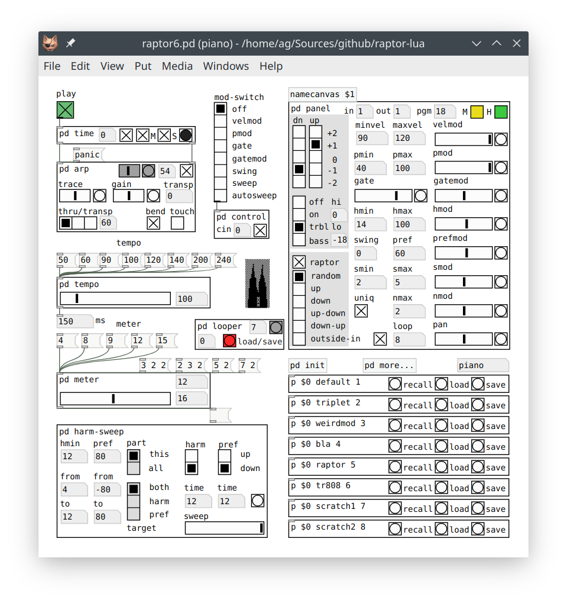

# Raptor: The Random Arpeggiator

March 2021  
Albert Gräf <aggraef@gmail.com>  
Dept. of Music-Informatics  
Johannes Gutenberg University (JGU) Mainz, Germany

The raptors6.pd patch implements an experimental arpeggiator program based on the contemporary composer Clarence Barlow's theories about harmony and meter. This is the 6th iteration of this program, ported to Lua so that it can be run easily with any Pd version. Compared to earlier versions, it also features much cleaner source code and some other noticeable improvements under the hood. We recommend running this patch with [Purr Data][], Jonathan Wilkes' modern Pd flavor, as it has all the required externals including Pd-Lua on board, and the layout of the GUI has been optimized for that version. But the patch should also work fine in "vanilla" [Pd][] if you have the [Pd-Lua][] and [Zexy][] externals installed (a version of Pd-Lua for Lua 5.3 or later is required, you can find this under the given URL).

A few sample presets are included in the presets folder, use the "p" abstractions in the lower right corner of the main patch to switch between these (or create your own). The main patch also has some controls to change meter and tempo, as well as an abundance of other parameters controlling the algorithm in the panel subpatch. If you need a whole band of Raptors to accompany you, multiple instances of the main patch can be run in concert in a single Pd instance. Just make sure that you select one of the instances as the time master ("M" toggle in the "time" subpatch) which happens automagically if you press the big green "play" toggle in one of the instances.

Raptor is quite advanced as arpeggiators go, it's really a full-blown algorithmic composition tool, although it offers the usual run-of-the-mill deterministic arpeggios as well. But the real magic starts to happen if you turn on "raptor" mode and start playing around with the parameters in the panel. Documentation still needs to be written. The algorithm behind Raptor is briefly sketched out in my [ICMC 2006 paper][] (cf. Section 8), but for the time being you'll have to dive into the source code and read Barlow's article in the [Ratio book][] to really understand how this stuff works.

Using the patch is easy enough, however. Hook up your MIDI keyboard and synthesizer to Pd's MIDI input and output, respectively, press "play" and input some chords. Most of the time, I'm using Raptor with a MIDI guitar setup and a [Nektar PACER][] foot pedal, so the patch is somewhat geared towards that use case, but it also works fine with just any MIDI keyboard and a free software synth such as [Qsynth][].

The patch contains a control subpatch for the PACER, and I've also included the modified PACER setup that I'm using (.syx file in the lib subfolder). My personal setup only uses presets D01-03 of the PACER, and these are the ones that I changed from the factory defaults. Changing the PACER's setup is quite easy using François Georgy's web-based [PACER Editor][]. But if you don't want to mess with your PACER, or if you use a different controller, you can modify the control subpatch to make it work for you. This is by no means required, though -- all the various switches and parameters can also be controlled with the GUI.

This is still work in progress. There's some stuff on the TODO list, such as MIDI bindings for all the parameters and a looper facility. The included presets also need some work, but they can hopefully get you started; feel free to use them for whatever purpose. Bug reports and other contributions are welcome. And please do send me links to music produced with Raptor!

[ICMC 2006 paper]: http://hdl.handle.net/2027/spo.bbp2372.2006.021
[Ratio book]: http://clarlow.org/wp-content/uploads/2016/10/THE-RATIO-BOOK.pdf

[Purr Data]: https://agraef.github.io/purr-data/
[Pd]: http://msp.ucsd.edu/software.html
[Zexy]: https://github.com/iem-projects/pd-zexy
[Pd-Lua]: https://agraef.github.io/pd-lua/
[Qsynth]: https://qsynth.sourceforge.io/
[Nektar PACER]: https://nektartech.com/pacer-midi-daw-footswitch-controller/
[PACER Editor]: https://studiocode.dev/pacer-editor
